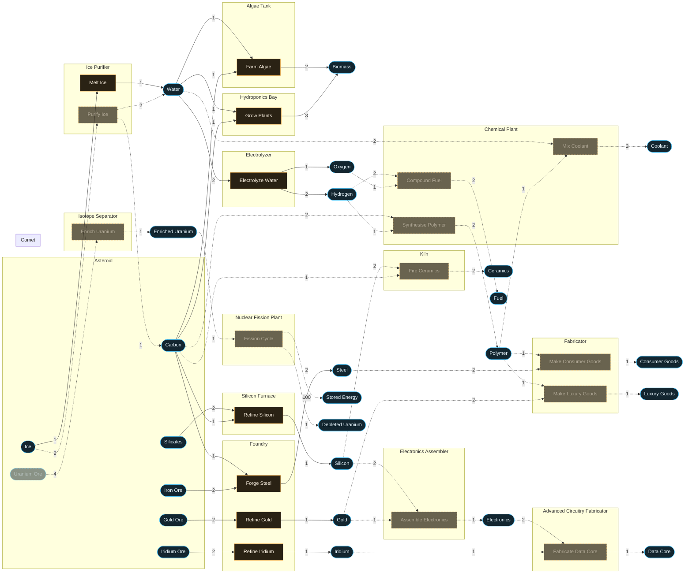

# Resource Flow

> [!warning] Generated file - do not edit by hand.
> `godot --headless -s tools/gen_resource_flow.gd` rebuilds it from
> `data/recipes/`, `data/modules/`, `data/space_bodies/`, `main.tscn`'s
> belt pool and `data/planned_flow.json`.
> **Solid = implemented. Dashed = planned** (edit `data/planned_flow.json`).

